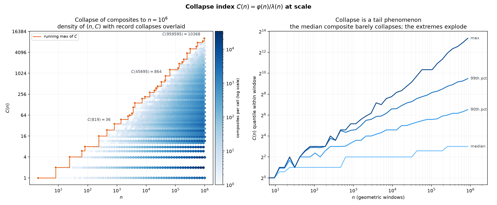
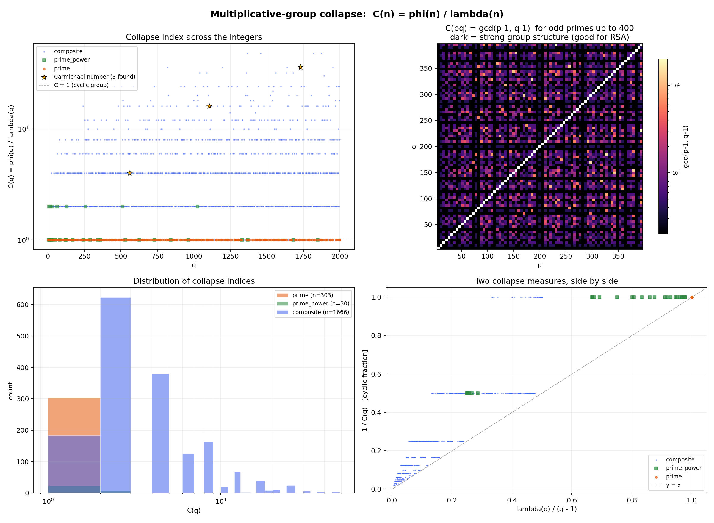
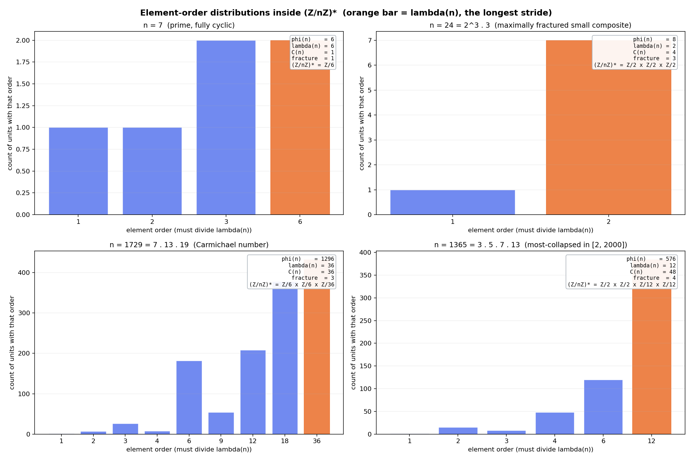
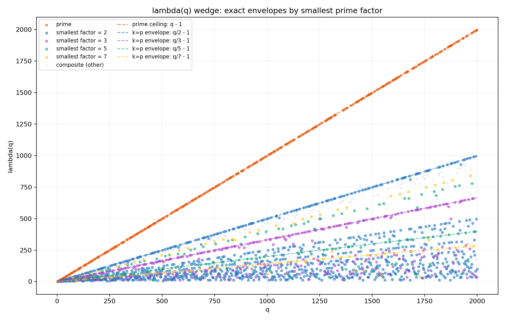
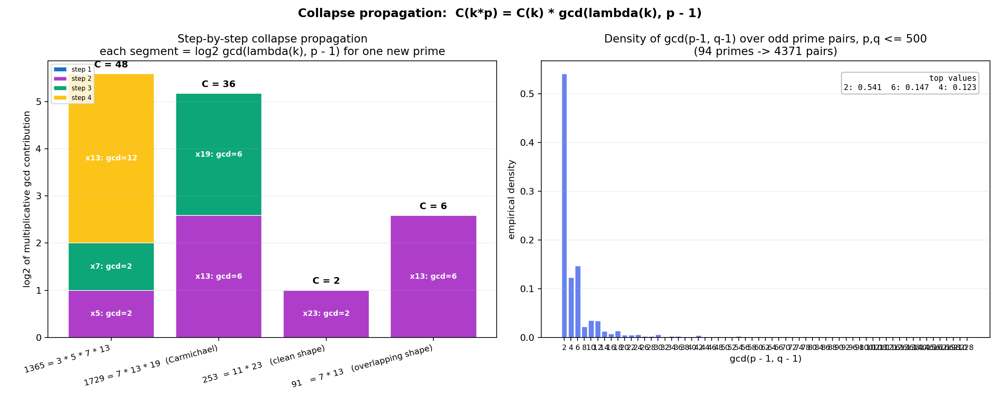
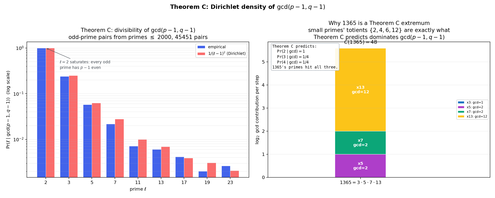

# lambda_ratio_explorer

[](https://github.com/WhatsYourWhy/lambda_ratio_explorer/actions/workflows/ci.yml)
[](./LICENSE)

> Factorization splits the multiplicative group into independent cyclic
> components. φ(n) counts the total elements; λ(n) is the maximum order of
> any element. Their ratio measures how badly those components fail to
> synchronize into a single cycle, and that obstruction is governed by the
> gcd of the component cycle lengths.

A small numerical and visual explorer for the multiplicative group `(Z/nZ)*`.
The central object is the **collapse index**

```text
C(n) = phi(n) / lambda(n)
```

where `phi` is Euler's totient and `lambda` is the Carmichael function.

`C(n)` is the size of the obstruction to `(Z/nZ)*` being a single cycle.
It is exactly **1** when the group is cyclic (every prime, every odd prime
power, plus a few small special cases) and grows as the group fractures
into more parallel components with shared cycle lengths.

For semiprimes `n = p*q` it has a clean closed form:

```text
C(p*q) = gcd(p - 1, q - 1)
```

This is precisely the quantity that controls cycle overlap in `(Z/nZ)*` and
is the cryptographic-strength dial in RSA-style moduli.

The core multiplicative law that organizes the rest of the repo is the
**collapse propagation theorem**:

```text
C(k * p) = C(k) * gcd(lambda(k), p - 1)        for prime p with p not dividing k
```

The companion statistical result (Theorem C) is the Dirichlet-density
identity `Pr(l | gcd(p - 1, q - 1)) -> 1/(l - 1)^2` for random odd primes,
which is what makes the small primes 2 and 3 dominate cycle overlaps in
practice.

For derivations, worked examples, and a connection to every figure here,
see [`THEOREM.md`](./THEOREM.md). A renderable PDF can be produced via
`render_theorem.ps1` (requires pandoc plus a LaTeX engine).



## Install

```bash
python -m venv .venv
.venv\Scripts\activate          # PowerShell on Windows
# source .venv/bin/activate     # bash / zsh
pip install -r requirements.txt
```

## Run

### Core scanner

`lambda_ratio_explorer.py` is the CLI. It computes `phi`, `lambda`, and
`C` for each `q` in a range and writes a table, optional CSV, and
optional scatter plot.

```bash
python lambda_ratio_explorer.py --q-max 200 --n 1000 \
    --csv runs/scan.csv --plot runs/scan.png
```

### Group-structure analysis (`group_structure.py`)

A 4-panel figure showing collapse behavior across q, the prime-pair
heatmap of `gcd(p-1, q-1)`, the distribution of `C` by structural kind,
and a side-by-side comparison of two collapse measures. Carmichael
numbers in the range are highlighted as gold stars.

```bash
python group_structure.py
# -> group_structure.png
```



### Order distributions (`order_distributions.py`)

The synchronization model made visible at the level of individual
elements. For four chosen `n` values (a prime, a small fractured
composite, a Carmichael number, and the most-collapsed value in our
scan range) it computes the multiplicative order of every unit and
plots the histogram. The orange bar marks `lambda(n)`, the longest
stride; the height distribution exposes the parallel-cycle structure
predicted by the invariant factor decomposition.

```bash
python order_distributions.py
# -> order_distributions.png
```



### Wedge envelopes (`wedge_envelopes.py`)

A focused plot showing that the upper edges of the `lambda(q)` wedge
are **exact** algebraic lines `q/k - 1`, indexed by the smallest prime
factor `k` of `q`. Useful as an algebraic warm-up before the collapse
discussion.

```bash
python wedge_envelopes.py
# -> wedge_envelopes.png
```



### Collapse propagation (`propagation.py`)

Iterative demonstration of the propagation theorem. Builds three example
numbers one prime at a time, prints the step-by-step trace, and produces
a 2-panel figure: stacked `log2 gcd` contributions on the left, and the
empirical density of `gcd(p-1, q-1)` over odd prime pairs on the right.

```bash
python propagation.py
# -> propagation.png
```



### Distribution of `gcd(p-1, q-1)` (`gcd_distribution_theory.py`)

Empirical verification of Theorem C. Computes the divisibility rate
`Pr(l | gcd(p-1, q-1))` over distinct odd-prime pairs up to a
configurable cutoff (`10^5` by default, switching to a fixed-seed
random sample of 2M pairs above the exhaustive threshold) and compares
it to the Dirichlet prediction `1/(l-1)^2`. At the `10^5` cutoff the
relative errors are around a percent. Also prints the empirical mean
gcd alongside the asymptotic estimate `A log X` with
`A = 315 zeta(3) / (2 pi^4) ~ 1.94`.

```bash
python gcd_distribution_theory.py
# -> gcd_distribution.png
```



### Collapse at scale (`collapse_at_scale.py`)

The full-range scan of `C(n)` to `n = 10^6`, using a smallest-prime-factor
sieve (one pass factors every n at once, so the scan takes seconds).
Produces a 2-panel figure: the density of `(n, C)` over all composites
with the running-maximum "collapse records" overlaid and labeled, and a
quantile fan (median / 90th / 99th / max of `C` by geometric window)
showing that collapse is a tail phenomenon. Prints the by-kind summary
table and the top records with factorizations.

```bash
python collapse_at_scale.py
# -> collapse_at_scale.png
```

### PDF of the theorem note (`render_theorem.ps1`)

```powershell
./render_theorem.ps1
# -> theorem.pdf
```

Requires pandoc plus a LaTeX engine (MiKTeX or TeX Live). See the script
header for fallback options if no LaTeX engine is available.

## What the data shows

Running `group_structure.py` over `q in [2, 2000]`:

| kind         | count | mean C | median C | max C | fraction with C=1 |
| ------------ | ----- | ------ | -------- | ----- | ----------------- |
| prime        | 303   | 1.00   | 1        | 1     | 1.000             |
| prime_power  | 30    | 1.27   | 1        | 2     | 0.733             |
| composite    | 1666  | 4.96   | 4        | 48    | 0.110             |

Primes are exactly cyclic. Composites collapse, and the collapse is
quantized in integer tiers. The most-collapsed values in the range are
products of small primes whose `(p_i - 1)` shares many common factors
(e.g. `1365 = 3 * 5 * 7 * 13` with `C = 48`).

The Hardy-Ramanujan number `1729 = 7 * 13 * 19` shows up near the top:
it is also a Carmichael number, and large `C` is part of why.

Scaling up with `collapse_at_scale.py` over `n in [2, 10^6]`:

| kind         | count  | mean C | median C | max C | fraction with C=1 |
| ------------ | ------ | ------ | -------- | ----- | ----------------- |
| prime        | 78498  | 1.00   | 1        | 1     | 1.000             |
| prime_power  | 236    | 1.07   | 1        | 2     | 0.928             |
| composite    | 921265 | 36.22  | 8        | 10368 | 0.045             |

The record holder below `10^6` is `959595 = 3 * 5 * 7 * 13 * 19 * 37`
with `C = 10368` -- the same story as `1365`, two primes deeper: the
totients `2, 4, 6, 12, 18, 36` all divide each other's lattice. The
median composite has `C = 8` while the maximum is `10368`, i.e. the
mean is dragged by a thin tail of heavily-shared-structure numbers;
the quantile fan in `collapse_at_scale.png` makes this visible.

## Cryptographic interpretation

For `n = p*q` (an RSA-shaped modulus), the order of an arbitrary unit
divides `lambda(n) = lcm(p-1, q-1)`, not `phi(n) = (p-1)(q-1)`. The
gap between them is `C(n) = gcd(p-1, q-1)`. Choosing `p`, `q` so that
`C(n)` is small (ideally 2) is part of what makes a modulus
cryptographically clean.

The heatmap panel of `group_structure.png` is exactly this map: bright
cells are prime pairs to avoid, dark cells are pairs whose totients
share little.

## Library functions of note

```text
phi(n)                          Euler totient
lambda(n)                       Carmichael lambda (group exponent)
collapse_index(n)               C(n) = phi/lambda
collapse_step(k, p)             one step of C(k*p) = C(k) * gcd(lambda(k), p-1)
collapse_propagation_trace(ps)  iterate the step over a list of primes
invariant_factors(n)            list d_1 | d_2 | ... | d_k describing (Z/nZ)*
fracture_count(n)               k = number of cyclic components
element_orders(n)               dict mapping each unit to its order
is_carmichael(n)                Korselt's criterion
divisors(n)                     sorted divisors of n
```

`collapse_step` and `collapse_propagation_trace` assert the propagation
identity at runtime, so they double as tests for the theorem in
[`THEOREM.md`](./THEOREM.md).

## Files

| File                       | Purpose                                                 |
| -------------------------- | ------------------------------------------------------- |
| `lambda_ratio_explorer.py` | Core library + CLI scanner                              |
| `group_structure.py`       | 4-panel structural analysis of `C(n)`                   |
| `order_distributions.py`   | Element-order histograms inside chosen `n`              |
| `wedge_envelopes.py`       | Algebraic envelope visualization                        |
| `propagation.py`           | Iterative demo of the collapse propagation theorem      |
| `gcd_distribution_theory.py` | Empirical verification of Theorem C                   |
| `collapse_at_scale.py`     | Sieve-based scan of `C(n)` to `10^6`, records + quantiles |
| `THEOREM.md`               | Wedge, propagation, and Dirichlet-density identities    |
| `render_theorem.ps1`       | Pandoc helper that renders `THEOREM.md` to `theorem.pdf`|
| `requirements.txt`         | `matplotlib` (pulls in numpy)                           |

## Notes

- Factorization strips small factors by trial division, then switches to
  Miller-Rabin primality testing plus Pollard rho. Comfortable with
  18-digit semiprimes; primality is deterministic below `3.3 * 10^24`.
- The legacy ratio `lambda(q) / log(n)` is retained in `Row` and the CLI
  for backward compatibility, but `log(n)` is just a constant scalar
  and does not enter the structural story. The interesting metrics are
  `lambda(q)`, `phi(q)`, and `C(q)`.

## License

[MIT](./LICENSE)
